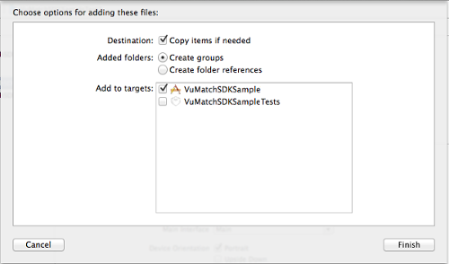
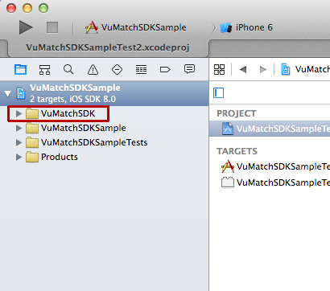
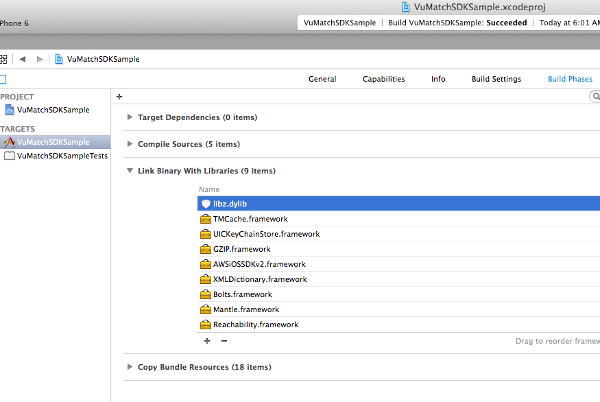
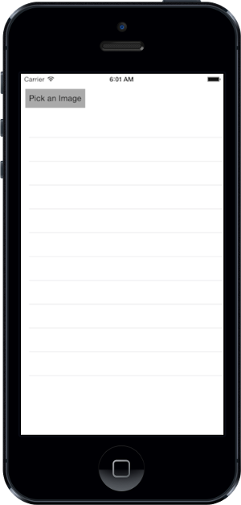

#Overview
This documentation describes how to use VuMatch iOS SDK.

#Getting started
*    Download [VuMatch iOS SDK](https://github.com/moataz/VuMatchIOS_sdk) to start developing.
*    [Register](http://www.vufind.com) to VuMatch API to get your customer id, application key and application token.

#Integration Steps
Follow the following steps to use VuMatch iOS SDK with any Android project.

*    Create your iOS project and add the folder VuMatchiOSSDK to it.




*    Open a target for your project, select Build Phases, expand Link Binary With Libraries, click the + button, and add libz.dylib.



*    Import VuMatchSDK.h. It's your entry point to use VuMatch iOS SDK

```c++ 
#import "VuMatchSDK.h"
```

*    Create a VuMatch API client to start calling VuMatch API.

```c++
VuMatchAPIClient *vuMatchAPIClient = [[VuMatchAPIClient alloc] initWithCustomerId:CUSTOMER_ID andAppKey:APP_KEY andAppToken:APP_TOKEN];
```
This line initialize VuMatch API client with: your customer id, application key and application token.

*    Now you can post an image to VuMatch API by calling method postImage.

```c++
[vuMatchAPIClient postImage:image inCategory:CATEGORY_NAME withDelegate:delegate];
```

This method takes three parameters: ```UIImage``` object of the image to be sent to VuMatch API, a category name, and a delegate that implements VuMatchAPIClientDelegate protocol to handleVuMatch the response from postImage.

After this method finishes it calls either ```vuMatchAPIClient: didFinishWithRecommendations:``` or ```vuMatchAPIClient: didFinishWithError:``` method of your delegate object passed in the third parameter depending on the state returned. Those two methods will run in your main thread while postImage itself runs in the background so that you shouldn't wait until you receive a response.

In case of success you will get an array of VuMatch recommendations through the array passed to didFinishWithRecommendations. Each object of the array will has two properties (skuId, score) that you can read them from each object.

In case of unexpected error occurred the didFinishWithError will be called with an object describes the error.

```c++
#pragma mark - VuMatch API Delegate

-(void)vuMatchAPIClient:(VuMatchAPIClient *)apiClient didFinishWithRecommendations:(NSArray *)recommendations {
    // Get the recommendations successfully
}

-(void)vuMatchAPIClient:(VuMatchAPIClient *)apiClient didFinishWithError:(NSError *)error {
    // An error has occurred
    NSLog(@"Error: %@", error);
}

#pragma end
```

#Sample Code

You can download [sample project](https://github.com/moataz/VuMatchIOS_sdk/VuMatchSDKSample.xcodeproj) that uses VuMatchSDK to post an image stored on device to VuMatch API and show a list of recommendations.

*    Download the sample project and open it in your xCode.

*    Open ViewController.m and replace the four #define constants (CUSTOMER_ID, APP_KEY, APP_TOKEN, CATEGORY) with your values.

```c++
// replace the following 4 constants with your correct values
#define CUSTOMER_ID @""
#define APP_KEY @""
#define APP_TOKEN @""
#define CATEGORY_NAME @""
```

*    After you run this sample project you should see the following:



*    Tap "Pick an Image" button to select an image.

```c++
- (void)pickImage:(id)sender
{
    
    UIImagePickerController *picker = [[UIImagePickerController alloc] init];
    
    
    picker.sourceType = UIImagePickerControllerSourceTypePhotoLibrary;
    picker.delegate = self;
    [self presentViewController:picker animated:YES completion:nil];
    
}
```

*    After you select the image the sample will post it to VuMatch API and show the list of recommendations.

```c++
-(void)imagePickerController:(UIImagePickerController *)picker didFinishPickingMediaWithInfo:(NSDictionary *)info {
    [picker  dismissViewControllerAnimated:YES completion:nil];
    UIImage *image = [info valueForKey:UIImagePickerControllerOriginalImage];
    if (image) {
        [activityIndicator startAnimating];
        [errorLabel setText:@""];
        
        VuMatchAPIClient *vuMatchAPIClient = [[VuMatchAPIClient alloc] initWithCustomerId:CUSTOMER_ID andAppKey:APP_KEY andAppToken:APP_TOKEN];
        [vuMatchAPIClient postImage:image inCategory:CATEGORY_NAME withDelegate:self];
    }
}

#pragma mark - VuMatch API Delegate

-(void)vuMatchAPIClient:(VuMatchAPIClient *)apiClient didFinishWithRecommendations:(NSArray *)recommendations {
    self.recommendationsArray = recommendations;
    [self.recommendationsTable reloadData];
    [activityIndicator stopAnimating];
}

-(void)vuMatchAPIClient:(VuMatchAPIClient *)apiClient didFinishWithError:(NSError *)error {
    self.recommendationsArray = nil;
    [self.recommendationsTable reloadData];
    [activityIndicator stopAnimating];
    NSLog(@"Error: %@", error);
}

#pragma end
```

~[VuMatch sample app](./docs/images/screen3.png)